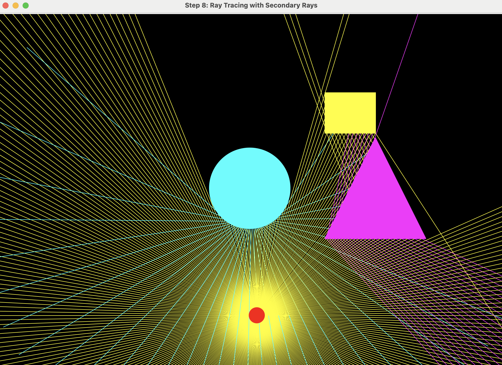

# Ray Tracing Tutorial

A step-by-step implementation of 2D ray tracing concepts.




## Overview

This tutorial demonstrates the fundamental concepts of ray tracing, from basic window creation to advanced intersection testing and secondary ray reflections. All implementations use only Python's standard library without any third-party frameworks.

## Features

### Step 1: Window Creation
- Basic canvas setup

### Step 2: Vector2D Class and Basic Shapes
- Vector operations (addition, subtraction, dot product, normalization)
- Drawing a single circle

### Step 3: Objects
- Circle, Triangle, and Rectangle classes

### Step 4: Mouse Interaction
- Drag and drop functionality
- Real-time rendering loop (~60 FPS)

### Step 5: Generate Ray
- Ray generation from a point
- Ray equation: `P(t) = Origin + t * Direction`

### Step 6: Light Source System
- Interactive light source
- Real-time ray regeneration

### Step 7: Ray Intersection and Shadows
- Ray intersection (circle, triangle and rectangle)
- Shadow generation through intersection

### Step 8: Secondary Ray Reflections
- Reflection direction calculation
- Surface normal computation for different shapes
- Secondary rays colored by the object they hit

## Requirements

- Python 3.6+
- tkinter (included in standard Python installation)
- Jupyter Notebook (for running the interactive tutorial)

## Installation

1. Clone this repository:
```bash
git clone https://github.com/SunWooChan/SimpleRayTracing.git
cd raytracing-tutorial
```

2. Ensure you have Jupyter Notebook installed:
```bash
pip install jupyter
```

## Usage

1. Launch Jupyter Notebook:
```bash
jupyter notebook
```

2. Open `Raytracing_tutorial.ipynb`

3. Run each cell sequentially to see the progression from basic concepts to advanced ray tracing


## Interactive Controls

- **Left Click + Drag**: Move light source or objects
- **Mouse Release**: Drop the selected item
- Objects can be moved in real-time while the ray tracing updates automatically

## Key Concepts

- **Vector Mathematics**: 2D vector operations essential for graphics
- **Geometric Shapes**: Implementation of basic 2D primitives
- **Ray Equation**: Mathematical foundation of ray tracing
- **Intersection Test**: Ray-object collision detection algorithms
- **Reflection**: Physics-based light reflection using surface normals
- **Real-time Rendering**: Event-driven GUI with continuous updates

## Acknowledgements

This tutorial motivated by [Daniel Hirsch](https://www.youtube.com/watch?v=2BLRLuczykM&t=515s)


